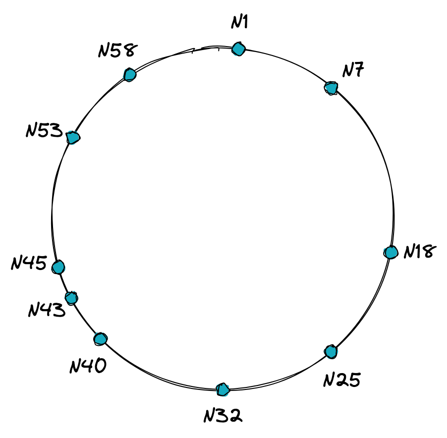
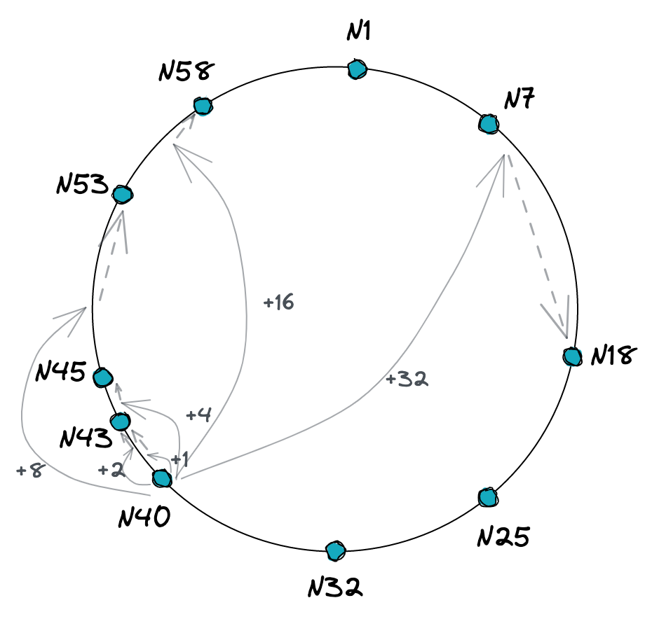
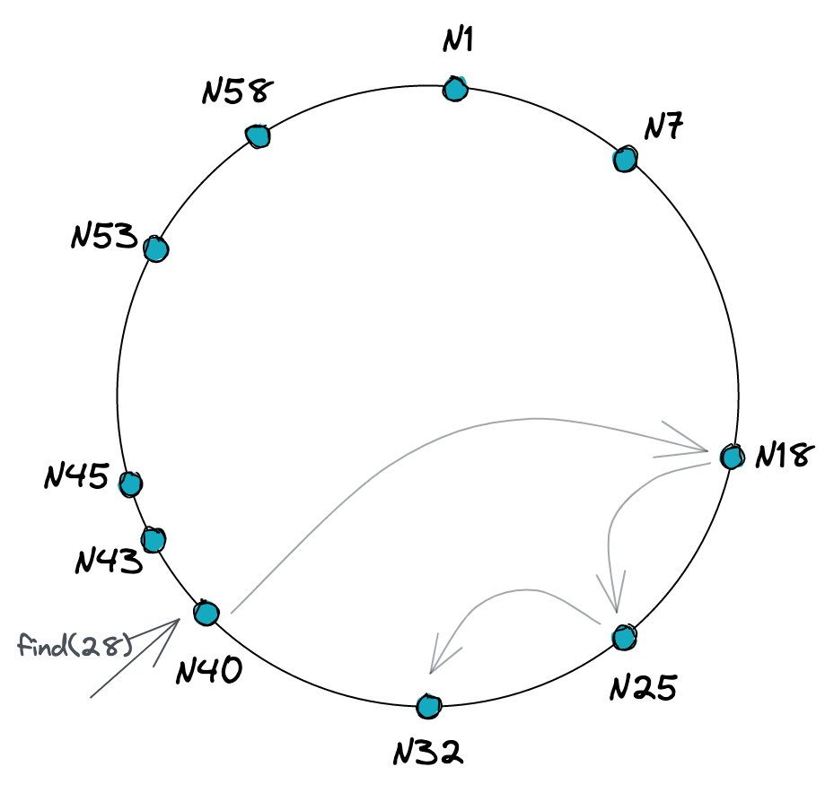

Chord is a protocol for building decentralized data storage systems. It is used to efficiently locate the node that stores a specific piece of data in a network of nodes. It only describes one operation: given a key, it maps the key to the responsible node. By linking a key to each data item and storing the key-value pair at the corresponding node, data location can be easily implemented using Chord. Additionally, Chord can adapt and respond to queries even when nodes are constantly joining or leaving the system. Theoretical analysis and simulations demonstrate that Chord is scalable, with communication costs and the size of each node growing logarithmically as the number of Chord nodes increases.

In this blog post, I will be documenting the steps I took to implement the Chord protocol using Rust programming language and explaining my thought process along the way. All the code can be found in the repo https://github.com/kamilczerw/chord. I created a branch for this post, so you can follow along with the code, which you can find [here](https://github.com/kamilczerw/chord/tree/chord).

I encorage you to read the original paper which describes Chord protocol in more comprehensive way. You can find it [here](https://pdos.csail.mit.edu/papers/ton:chord/paper-ton.pdf).

## Chord protocol

The protocol is designed in such a way that no organization can control the network without owning the majority of the nodes. When a node joins the network it gets an *id* generated based on its IP address. The *id* is generated using a consistent hashing algorithm, to evenely distribute *ids* in the network.

The core principle of the Chord protocol is that nodes do not need to maintain a complete list of all the other nodes in the network. Instead, each node only needs to maintain information about a small number of neighboring nodes. 

Imagine the network as a *ring* with nodes distributed along it. For demonstration, let’s consider a *ring* with 10 nodes that can only handle 64 unique identifiers. This *ring* structure allows efficient routing of messages and ensures that each node only needs to maintain information about a small number of nodes to efficiently route messages and find the correct destination node. 



Each of the nodes is responsible for maintaining a range of *ids*, starting with *ids* following the *id* of the previous node and including its own *id*. For example, in our demo network, node `N7` is responsible for *ids* `2-7`. Node `N1` is responsible for *ids* `59-63` and `0-1`. This is because the node `N58` is preceding node `N1` in the *ring*.

A node responsible for an *id* `k` is called a `successor` of `k`. In the rest of this post, I will use the term `successor` to refer to the node responsible for a given *id*.

Ids in the *ring* are numeric to be able to easily calculate the successor of a given *id*. In our example network, we will use a 6-bit identifier space, which means that the network can handle up to 64 unique identifiers. I will use 64-bit unsigned integers to represent *ids* in the code.
In real-world applications, we would prefer to use string representation of *ids* to make it easier to read and understand. To refer to string representation of *ids* we will use the term *key*. The *key* is converted to a numeric representation using a consistent hashing algorithm. 


### Lookup

To find the location of a *key*, each node uses a hash function to map the *id* to a position on the *ring*. It then uses so called *finger table*, to determine which node is responsible for the *id*. The *finger table* is a data structure that helps the node quickly locate other nodes in the network. The *finger table* is a table of size `m` (where `m` is the number of bits in the identifier space, in our example, it’s `6`). Each entry in the *finger table* contains 

- Identifier, calculated with the formula 

 (n+2^{k-1}) \mod {2^m}

- Node communication information, which includes IP address and port

Here is the *finger tables* for node `N40` from our example network:



| k | finger id | node |
| --- | --- | --- |
| 1 | 41 | N43 |
| 2 | 42 | N43 |
| 3 | 44 | N45 |
| 4 | 48 | N53 |
| 5 | 56 | N58 |
| 6 | 8 | N18 |

 As you can see in the example the *finger id* doesn’t map directly to the *node id*, it is used as an approximation of the location of an *id* we are looking for. When a node receives a request to find a specific *id*, it checks the finger table to see which *finger id* is closest to the requested *id* but still lower than the *finger id*. The node then forwards the request to the node returned from the *finger table*. The node that receives the request then repeats the process until it finds the node responsible for the *id*.

Here is a visualization of the process of finding the node responsible for *id* `20` in our example *ring*, using a lookup from node `N40`:



### Joining

When a node joins the *Chord ring*, it first needs to find its place in the network. It calculates its *id* by hashing its IP address and then uses the lookup operation to find the the `successor` of the *id*. Immediate `successor` is the node that is responsible for the next id after the *id* of the joining node.

Once the node has found its `successor`, it sends a `notify` request to the `successor` node. The `notify` message contains the *id* and communication information of the joining node. The `successor` node then checks if the joining node is a better `predecessor` than its current `predecessor`. If the joining node is a better `predecessor`, the `successor` node updates its `predecessor` to the joining node.

`predecessor` is a node that is previous node in the *ring*. It is used to maintain the correct relationships between nodes in the network.

Each node runs a `stabilize` job periodically. The `stabilize` job is responsible for ensuring that each node knows the correct successor and predecessor nodes in the *Chord ring*. It does this by checking if the current successor node has a predecessor that is closer to the current node than the current successor node. If this is the case, the current node updates its successor to the new node. Additionally, the stabilize job also checks if the current predecessor node is still alive by sending a ping message to it. If there is no response, the current node updates its predecessor to the new node.

In summary, the `stabilize` job is responsible for maintaining the correct relationships between nodes in the *Chord ring* and ensuring that the network is in sync.

### Consistent hashing

A consistent hash function assigns each node and key an `m`-bit identifier using a hash function. The original paper uses `SHA-1`, but it is important to note that this hash function is not recommended for use in new systems due to known weaknesses. Instead, there are other more secure hash functions that are recommended, such as `SHA-256` or `BLAKE2`. The node's identifier is chosen by hashing its IP address, while a key identifier is produced by hashing the key.

This method ensures that the probability of two nodes or keys hashing to the same identifier is negligible, making it an efficient way to distribute data across a network.

The keys are assigned to nodes by ordering the identifiers on an identifier circle modulo 
 2^m
. The key, `k`, is assigned to the first node whose identifier is equal to or follows (the identifier of) `k` in the identifier space. This node is called the successor node of key `k`, denoted by `successor(k)`.

In practice, consistent hashing is a simple yet effective technique for data distribution in distributed systems. It's easy to implement and it provides a good balance between the number of keys that need to be remapped when a node is added or removed, and the number of keys that can be mapped to the same node.

## Implementation

Enough with the theory, let’s get our hands dirty with some coding. The first thing we need is to set up the project. I use cargo workspaces to split my projects into smaller modules. It is a great way to keep the project organized.

### Project setup

We will use the following structure for our project:

```
root/
  Cargo.toml
  server/
  libs/
    chord/
```

- `server` will contain all the code related to run the server
- `libs/chord` will contain all the code related to chord node implementation

First, create a `Cargo.toml` file in the root directory of the project.

```toml
[workspace]

members = [
    "server",
    
    # Libs
    "libs/*",
]
```

This will tell cargo where to find all the modules.

Now we can create modules for our Chord project by executing the following commands:

```bash
cargo new server
cargo new libs/chord --lib
```

### Chord module

As mentioned earlier, this module will contain all the code specific for the Chord protocol. 

We will start by creating `Node` struct. It will contain the node identifier and IP address along with the port.

```rust
use std::net::SocketAddr;
use seahash::hash;

#[derive(Clone)]
pub struct Node {
    id: u64,
    addr: SocketAddr
}

impl Node {
    pub fn new(addr: SocketAddr) -> Self {
        Self { id: hash(&addr.to_string().as_bytes()), addr }
    }
}
```

Then `new` method only takes an address and creates an instance of `Node` with a unique identifier. The identifier is created by hashing the address using `seahash` hash function. We don't need to expose the `id` field, so the user doesn't have to worry about generating it manually.

Next, let's create `NodeStore` struct. It will contain all the necessary information required to effectively communicate with other nodes in the *ring*.

```rust
pub struct NodeStore {
    predecessor: Option<Node>,
    finger_table: Vec<Finger>
}

impl NodeStore {
    pub fn new(successor: Node) -> Self {
        Self {
            predecessor: None,
            finger_table: Finger::init_finger_table(successor),
        }
    }

    pub(crate) fn successor(&self) -> &Node {
        &self.finger_table[0].node
    }
}
```

The `predecessor` field contains information about the node preceding the current node in the *Chord ring*. Whe need to store this information to keep the *ring* in sync. When a node runs a `stabilize` job, it checks if it still is the `predecessor` of its `successor`. If it is not, it updates the *finger table* to include the new node. The `finger_table` field contains information about some of the nodes in the *ring* for easier lookup. We also have a `successor` method that returns the first node in the finger table, which is the immediate `successor` of the current node.

When the `finger_table` is created, all the fingers are pointing to the same node, which is the immediate `successor` of the current node. The `init_finger_table` method is used to initialize the finger table.

Let's create the `Finger` struct and implement some methods. The struct will have `start` field, which is a starting *id* from which the node is potentially responsible for. It will also have the `node` field.

```rust
pub(crate) struct Finger {
    start: u64,
    node: Node
}

impl Finger {
    pub(crate) fn init_finger_table(node: Node) -> Vec<Self> {
        let mut fingers = Vec::with_capacity(64);

        // We start at 1 because the calculation of the finger id is based on the index
        // of the finger. The calculation assumes that the index starts at 1.
        for i in 1..65 {
            let finger_id = Self::finger_id(node.id, i);
            fingers.push(Finger { start: finger_id, node: node.clone() });
        }

        fingers
    }

    pub(crate) fn finger_id(node_id: u64, index: u8) -> u64 {
        if index == 0 {
            return node_id;
        }

        let offset: u128 = 2_u128.pow((index - 1) as u32);
        let power: u128 = 2_u128.pow(64 as u32);

        let id = (node_id as u128 + offset) % power;

        id as u64
    }
}
```

To be able to communicate with other nodes we need a client. We haven't chosen a specific protocol yet, so we will create a trait that will be implemented by the client for the specific protocol.

Here is the code for the trait:

```rust
use crate::Node;

pub trait Client {
    fn init(node: Node) -> Self;
    fn find_successor(&self, id: u64) -> Result<Node, ClientError>;
    fn successor(&self) -> Result<Node, ClientError>;
    fn predecessor(&self) -> Result<Option<Node>, ClientError>;
    fn notify(&self, predecessor: Node) -> Result<(), ClientError>;
    fn ping(&self) -> Result<(), ClientError>;
}

pub enum ClientError {
    ConnectionFailed(Node),
    Unexpected(String),
}
```

If we try to build the project now we will get an error. That’s because we haven't added `seahash` crate, which is used to generate *id* for our node.

Go ahead and add the dependency to `libs/chord/Cargo.toml`

```toml
## libs/chord/Cargo.toml
[dependencies]
seahash = "4.1.0"
```

When you run `cargo build`, there should be no errors.

Next thing we need is `NodeService` which will contain all to logic associated with Chord protocol.

I will walk you through each function and explain what it does. For now, let’s just create the struct and add the error enum.

```rust
use std::net::SocketAddr;
use crate::NodeStore;

pub struct NodeService {
    id: u64,
    addr: SocketAddr,
    store: NodeStore,
}

pub mod error {
    pub enum ServiceError {
        Unexpected, // We don't expect to get any errors for now
    }
}

impl NodeService {
    // We will add our code here
}
```

#### Find successor

First function we will implement based on the spec is *find successor*. It is the entry point for key lookup in the *ring*. For a given key it returns a node which is responsible for that key. Such node is called successor of the key. Find successor was covered in the [lookup chapter](#lookup).

Here is the pseudocode from the spec:

>
> ```
> // ask node n to find the successor of id
> n.find_successor(id)
>   if (id ∈ (n, successor]) 
>     return successor;
>   else
>     n′ = closest_preceding_node(id); 
>     return n′.find_successor(id);
> 
> // search the local table for the highest predecessor of id
> n.closest_preceding_node(id)
>     for i = m downto 1
>         if (finger[i] ∈ (n,id))
>             return finger[i];
>     return n;
> ```
>

Let’s break this function down.

- The request comes to the node `n` to find the key `id`
- If the `id` is between `n` (exclusive) and `successor` (inclusive), return `successor`
- Otherwise get a node from the finger table, with highest `id` which is lower than the `id` we are looking for. This node is called `closest preceding node`, and we call `find_successor` on this node with the `id` we are looking for. That node will repeat the same process until it finds the successor of the `id`.

We need to create a function which checks if an `id` is between 2 nodes on the *ring*, we can add it to `Node` struct.

```rust
impl Node {
    // ...

    pub fn is_between_on_ring(id: u64, node1: u64, node2: u64) -> bool {
        if node1 < node2 {
            node1 < id && id <= node2
        } else {
            node1 < id || id <= node2
        }
    }
}
```

We also need to implement `closest_preceding_node` function. It will return the node from the finger table which is the most immediate `predecessor` of the `id`.

```rust
impl NodeService {
    // ...
    fn closest_preceding_node(&self, id: u64) -> &Node {
        for finger in self.store.finger_table.iter().rev() {
            if finger.start > self.id && finger.node.id < id && finger.start < id {
                return &finger.node;
            } else if id < self.id {
                // if the id is smaller than the current node, we return the last finger
                return &finger.node;
            }
        }

        self.store.successor()
    }
}
```

It iterates over the finger table in reverse order, and returns the first node which is the preceeding the `id`. If the `id` is smaller than the current node, it returns the last finger. That's because the node doesn't have a finger which is smaller than the current node.

Now we can implement `find_successor` method.

```rust
impl NodeService {
    // ...

    pub fn find_successor(&self, id: u64) -> Result<Node, error::ServiceError> {
        if Node::is_between_on_ring(id, self.id, self.store.successor.id) {
            Ok(self.store.successor.clone())
        } else {
            let node = self.closest_preceding_node(id);
            // 🤔 Wait a secode, how do we call the node to find the successor?
        }
    }
}
```

We check if the `id` is between the current node and the successor. If it is, we return the successor. Otherwise we call `closest_preceding_node` to get the node which is the most immediate predecessor of the `id` in our finger table. We need to call `find_successor` on that node, but we don't have a client to do that. We should fix it.

We can add a `client` method to `Node` struct.

```rust
impl Node {
    // ...

    pub fn client<C: Client>(&self) -> C {
        C::init(self.addr)
    }
}
```

We don't know what type of client we will use, so we use a generic type `C` which implements `Client` trait and let the implementer decide what type of client it will be.

Now we can get the client from the node and call `find_successor` on it.

```rust
impl NodeService {
    // ...

    pub fn find_successor(&self, id: u64) -> Result<Node, error::ServiceError> {
        if Node::is_between_on_ring(id, self.id, self.store.successor.id) {
            Ok(self.store.successor.clone())
        } else {
            let client = self.closest_preceding_node(id).client();
            let successor = client.find_successor(id)?;

            Ok(successor)
        }
    }
}
```

Mutch better. Let's try to build the project now.

```bash
cargo build

```

Oh noes, we get an error 😠

```
error[E0282]: type annotations needed
   --> libs/chord/src/service/mod.rs:121:17
    |
121 |             let client = predecessor.client();
    |                 ^^^^^^
122 |             if let Err(ClientError::ConnectionFailed(_)) = client.ping() {
    |                                                            ------ type must be known at this point
    |
help: consider giving `client` an explicit type
    |
121 |             let client: _ = predecessor.client();
    |                       +++

For more information about this error, try `rustc --explain E0282`.
error: could not compile `chord-rs` due to previous error
```


The compiler doesn't know what type `client` variable should be. We can fix it by doing something like `let client: Box<dyn Client> = //...` , but we don’t want to have a dynamic client, because we will use the same implementation of `Client` in the entire application. There is a better way. We can add a generic type to `NodeService`.

Let’s change `NodeService` to be generic over `C: Client`.

```rust
pub struct NodeService<C: Client> {
    // ...
}

impl<C: Client> NodeService<C> {
    // ...
}
```

Now we can set the type to our `client` variable

```rust
let client: C = self.closest_preceding_node(id).client();
```

Let’s try to build again.

```
error[E0392]: parameter `C` is never used
 --> libs/chord/src/service/mod.rs:7:24
  |
7 | pub struct NodeService<C: Client> {
  |                        ^ unused parameter
  |
  = help: consider removing `C`, referring to it in a field, or using a marker such as `PhantomData`
```

😡 Why is it failing? We clearly use `C` in our code. 

If you look closer at the error, you will see that the `C` type is not used in the `struct`. To fix it, we need to add `std::marker::PhantomData`. It tells the compiler that your type acts as it stores a value of type `C`, even though it doesn’t really. The `struct` should look like this:

```rust
pub struct NodeService<C: Client> {
    // ...
    phantom: PhantomData<C>,
}
```

Everything should build again 🎉

#### Join

Next function we will implement is `join`. Let’s take a look at the paper to see the definition.

> 
> *Figure 6 shows the pseudocode for joins and stabilization.*
> *When node n first starts, it calls n.join(n'), where n' is any known Chord node, or n.create() to create a new Chord network. The join() function asks n' to find the immediate successor of n. By itself, join() does not make the rest of the network aware of n.*
> 
> 
> ```
> // join a Chord ring containing node n'.
> n.join(n')
>   predecessor = nil;
>   successor = n'.find_successor(n);
> 
> // create a new Chord ring.
> n.create()
>   predecessor = nil;
>   successor = n;
> ```
> 

We don’t need to implement `create` because we already set the `successor` to itself when creating the `NodeService`.

The `join` method calls the node `n'` to find a successor of id `n`. To explain this, we can use our example from above. 

There is a node with id `N10` and it wants to join the *ring*. The node `N10` knows about `N1`, so it calls `N1.find_successor(N10)`. Node `N1` responds with `N18`, so `N18` should be the node which is the successor of node `N10`.

Here is the rust implementation of `join` function

```rust
impl NodeService {
    // ...

    pub fn join(&mut self, node: Node) -> Result<(), error::ServiceError> {
        let client: C = node.client();
        let successor = client.find_successor(self.id)?;
        self.store.successor = successor;

        Ok(())
    }
}
```

That one was quite simple.

#### Notify

So far so good, this function should also be pretty simple to implement. 

```
// n' thinks it might be our predecessor.
n.notify(n')
  if (predecessor is nil or n' ∈ (predecessor, n))
    predecessor = n';
```

Our node `N18` receives a notify request from `N10`, that it might be `N18`'s new predecessor. Node `N18` needs to check if `N10` is between its own predecessor (`N7`) and itself. If no other node joined in the meantime the node `N10` will be set as a predecessor of node `N18`.

```rust
impl NodeService {
    // ...

    pub fn notify(&mut self, node: Node) {
        let predecessor = self.store.predecessor();
        if predecessor.is_none() || Node::is_between_on_ring(node.id.clone(), predecessor.unwrap().id, self.id) {
            self.store.set_predecessor(node);
        }
    }
}
```

Another one is done.

#### Stabilize

> *Every node runs stabilize() periodically to learn about newly joined nodes. Each time node n runs stabilize(), it asks its successor for the successor's predecessor p, and decides whether p should be n's successor instead. This would be the case if node p recently joined the system. In addition, stabilize() notifies node n's successor of n's existence, giving the successor the chance to change its predecessor to n. The successor does this only if it knows of no closer predecessor than n.*
> 
> ```
> // called periodically. verifies n’s immediate
> // successor, and tells the successor about n.
> n.stabilize()
>   x = successor.predecessor;
>   if (x ∈ (n,successor))
>     successor = x;
>   successor.notify(n);
> ```
> 

The `stabilize` method should run periodically, to update the node’s successor when a new node joins the *ring*. It does it by asking for a predecessor of it’s successor. When the returned node (we will call it `x`) is between node `n` and successor of `n` then the new successor of `n` is set to `x`. 

We can explain it on our example *ring*. Here are the steps taken when the node `N10` joins the ring:

1. Node `N10` sets `N18` as it’s successor (it's done by `join` method)
2. Node `N10` runs `stabilize`
    1. Node `N10` calls node `N18` for it’s predecessor
    2. `N7` is returned, so the successor is not changed. 
3. Node `N10` calls `notify` on node `N18`.
4. Node `N18` checks if `N10` is between `N8` and `N18`
5. Node `N18` sets `N10` as it’s new predecessor
6. Node `N7` runs `stabilize` 
    1. Node `N7` calls node `N18` for it’s predecessor
    2. `N10` is returned
    3. `N10` is between `N7` and `N18`
    4. Node `N7` sets `N10` as it’s successor 

Here is the Rust implementation of `stabilize` method

```rust
impl NodeService {
    // ...

    pub fn stabilize(&mut self) -> Result<(), error::ServiceError> {
        let client: C = self.store.successor().client();
        let result = client.predecessor();
        if let Ok(Some(x)) = result {
            if Node::is_between_on_ring(x.id.clone(), self.id, self.store.successor().id) {
                self.store.set_successor(x);
            }
        }

        let client: C = self.store.successor().client();
        client.notify(Node { id: self.id, addr: self.addr })?;

        Ok(())
    }
}
```

#### Fix fingers

> *Each node periodically calls fix_fingers to make sure its finger table entries are correct; this is how new nodes initialize their finger tables, and it is how existing nodes incorporate new nodes into their finger tables*
>
> ```
> // called periodically. refreshes finger table entries.
> // next stores the index of the next finger to fix.
> n.fix_fingers()
>   next = next + 1;
>   if (next > m)
>       next = 1;
>   finger[next] = find_successor(n + 2^next−1);
> ```

The `fix_fingers` method is called periodically to update the *finger table*. It ensures that all the *finger table* entries are correct. It is also used to initialize the *finger table* of a newly joined *node*.

The `next` variable is used to keep track of the next finger to fix. It is incremented after each call to `fix_fingers`. When the `next` variable is greater than the number of fingers in the *finger table* it is reset to 1. 

We don't have to keep track of the `next` variable in our implementation, because we can just iterate over the *finger table*. Let's do that.

```rust
impl NodeService {
    // ...

    pub fn fix_fingers(&mut self) {
        for finger in self.store.finger_table.iter_mut() {
            if let Ok(successor) =  self.find_successor(finger.start) {
                finger.node = successor;
            }
        }
    }
}
```

This looks pretty simple, but unfortunately it won't work. It won't even compile. When we try to compile it we get the following error:

```
error[E0502]: cannot borrow `*self` as immutable because it is also borrowed as mutable
   --> libs/chord/src/service/mod.rs:148:37
    |
147 |         for finger in self.store.finger_table.iter_mut() {
    |                       ----------------------------------
    |                       |
    |                       mutable borrow occurs here
    |                       mutable borrow later used here
148 |             if let Ok(successor) =  self.find_successor(finger.start) {
    |                                     ^^^^^^^^^^^^^^^^^^^^^^^^^^^^^^^^^ immutable borrow occurs here
```

The problem is that we are trying to borrow `self` as mutable and immutable at the same time. We can't do that. Maybe the `next` variable is not that bad after all. We will not increment it as described in the paper, we will use for loop.


```rust
impl NodeService {
    // ...

    pub fn fix_fingers(&mut self) {
        for i in 0..self.store.finger_table.len() {
            let id = self.id + 2u64.pow(i as u32);
            if let Ok(successor) =  self.find_successor(id) {
                self.store.finger_table[i].node = successor;
            }
        }
    }
}
```

That works, because we don't hold on to `self` when iterating over the fingers, so we can call `self.find_successor` without any problems.


#### Check predecessor

Another task which has to be run periodically is `check_predecessor`.

```
// called periodically. checks whether predecessor has failed.
n.check_predecessor()
  if (predecessor has failed)
    predecessor = nil;
```

Each node needs to ping its predecessor to see if it is still up. If not the predecessor is removed from the node.

```rust
impl NodeService {
    // ...

    pub fn check_predecessor(&mut self) {
        if let Some(predecessor) = self.store.predecessor() {
            let client: C = predecessor.client();
            if let Err(ClientError::ConnectionFailed(_)) = client.ping() {
                self.store.unset_predecessor();
            };
        }
    }
}
```

## Conclusion

This blog post has become a bit bigger than what I anticipated. I tried to cover all the code with tests, but I decided not to include them in this post. You can take a look at the repo and see the tests there. [https://github.com/kamilczerw/chord/tree/chord](https://github.com/kamilczerw/chord/tree/chord).

I plan to write a follow-up post where I will go through the RPC implementation. I will also write a post about how to run the code. I hope you enjoyed reading it. If you have any questions or comments, feel free to open an issue in the [repo](https://github.com/kamilczerw/chord/issues/new) or reach out to me on [matrix](https://matrix.to/#/@ka:potatis.co).
